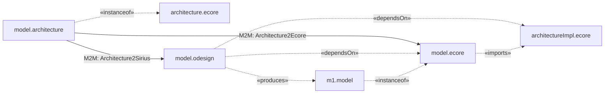

# Architecture2Sirius

This QVTo project performs a Model-to-model (M2M) transformation from an *".architecture"* (metamodel: architecture.ecore) model an [Eclipse Sirius](https://www.eclipse.org/sirius/) .odesign file.

## UML diagrams

You can see the following mermaid code as a diagram with [this](https://github.com/BackMarket/github-mermaid-extension) browser extension

Main entry point: https://github.com/tuiSSE/sirius-meta-editor
